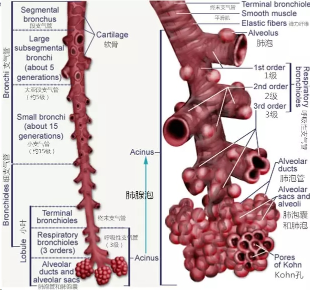
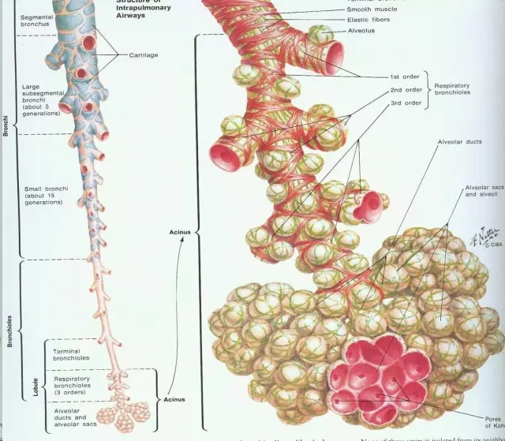
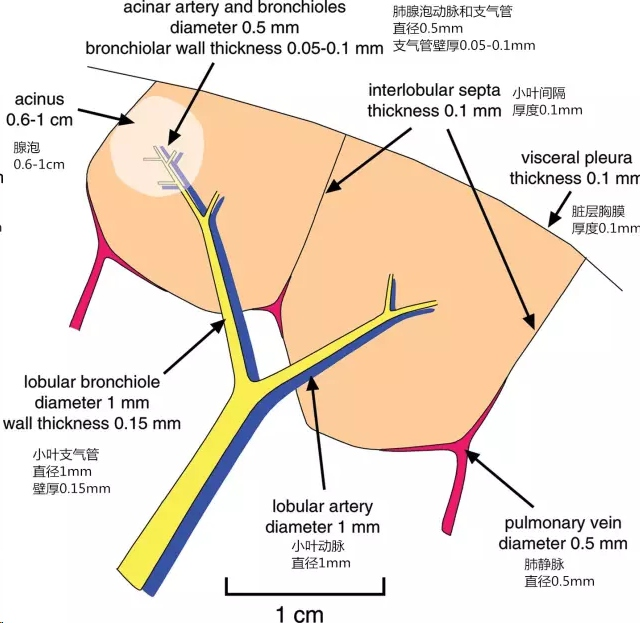
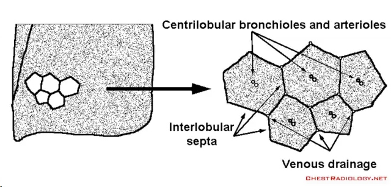
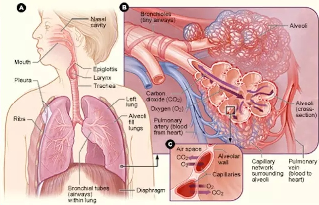
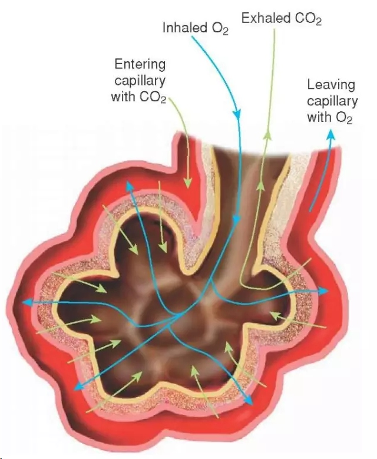
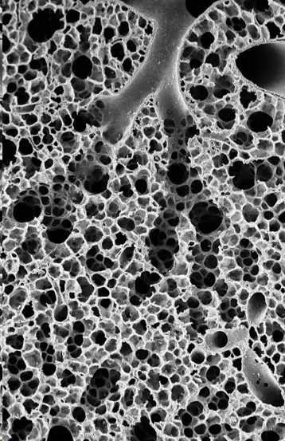

# acinus肺腺泡
## 解剖
> 肺腺泡是肺终末支气管远端的结构单位，由Ⅰ级呼吸细支气管供应。它包含了肺泡管和肺泡。它的构成部分都参与气体交换，故它是最大的气体交换单位（肺的基本功能单位）。肺腺泡直径大小约6-10mm。一个二级肺小叶含有3~25个肺腺泡。

Inhaled O2（吸入氧气），Exhaled CO2（呼出二氧化碳），肺腺泡周围毛细血管，携带CO2进入，携带O2离开。完成整改气体交换。

电子显微镜下，肺泡吸入气体的状态
***

## X线成像和CT扫描
单个正常的肺腺泡是不可见的，在薄层CT扫描上腺泡动脉偶尔可以分辨。当腺泡积聚了病理物质后，在X线胸片和薄层CT上可表现为分界不清的结节样。

上图为1mm 厚下肺叶外周肺组织切层，可见两个清晰的二级小叶，由小叶间隔（S）分界，含有肺静脉（V）分支。支气管（B）及肺动脉（A）位于小叶中央。