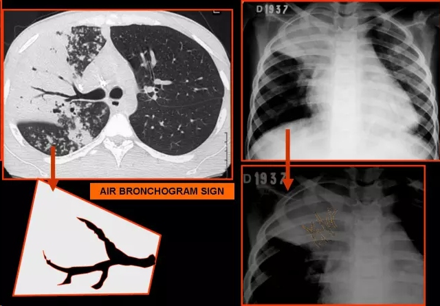
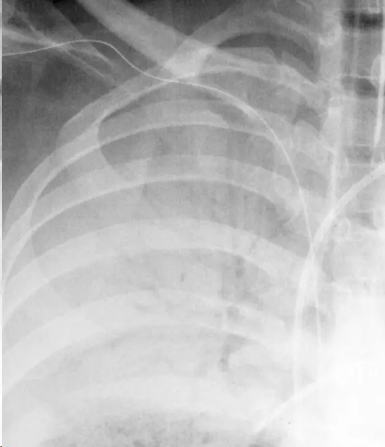
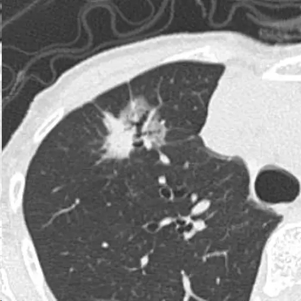
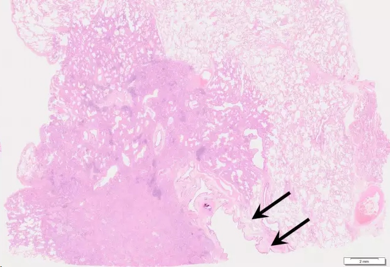
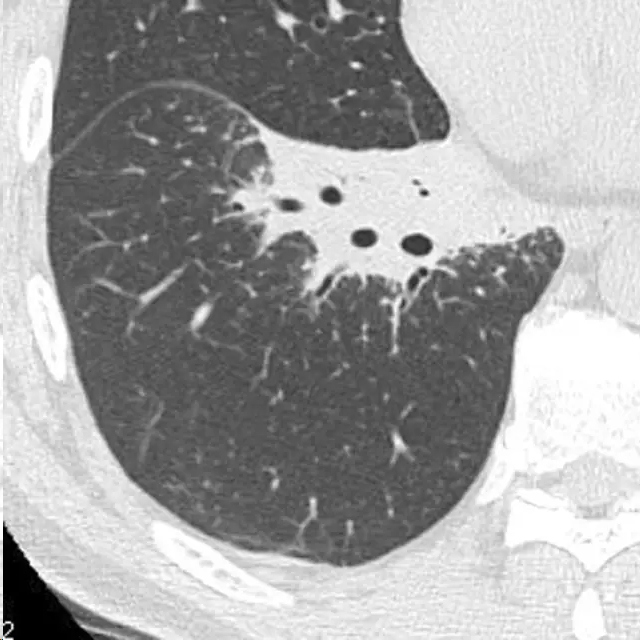
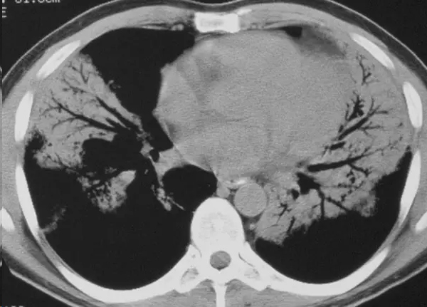

# 支气管空气征 air bronchogram
## Radiographsand CT scans（英）
An air bronchogram is a pattern of air-filled (low-attenuation)bronchi on a background of opaque (high-attenuation) airless lung . The sign implies (a) patency of proximal airways and (b) evacuation of alveolar airby means of absorption (atelectasis) or replacement (eg, pneumonia) or acombination of these processes. In rare cases, the displacement of air is the result of marked interstitial expansion (eg, lymphoma) (8).
## X线成像与CT扫描 （中）
空气支气管征是指在不透亮的（高密度）不含空气的肺组织内衬托出充盈有气体的支气管（低密度）。这种征象意味着（a）近侧支气管通畅，（b）肺泡内的空气被排出，如被吸收（肺不张）或被取代（如，肺炎）或这些过程都存在。在比较少见的情况下，空气被取代的结果是有显著的间质扩张所致（如，淋巴瘤）。

Pneumonia. Chest radiograph shows consolidation with air bronchogram. 肺炎，胸部照片显示实变中伴有空气支气管征。

Adenocarcinoma. Thin-section CT (TSCT) shows an “air bronchogram” running into the lesion. 肺腺癌。薄层CT（TSCT）显示空气支气管征进入病灶。

Adenocarcinoma. Pathological microphotograh in low magnification view shows dilated bronchiole (arrow) entering into the tumor.肺腺癌，病理低倍显微镜下显示扩张的支气管（箭）进入肿瘤内。

MALT lymphoma. TSCT shows an “air bronchogram” in the lesion. MALT淋巴瘤，薄层CT扫描显示病灶里出现空气支气管征。
【编者注：MALT lymphoma is a rare B-cell non-Hodgkin's lymphoma that typically runs an indolentor slow-growing clinical course.MALT 淋巴瘤是一种罕见的B细胞非何杰金氏淋巴瘤，临床特点为生长怠惰，缓慢。】
MALT is an acronym:
Mucosa  Associated  Lymphatic  Tissue

大家注意看看上表，第一个征象air bronchogram 在哪些病变中容易出现呢？包括：腺癌（＋）、鳞状上皮癌（±）、局灶机化性肺炎（＋）、MALT(＋）；错构瘤是不会出现这个征象的。

诊断一下这个病例是什么病？