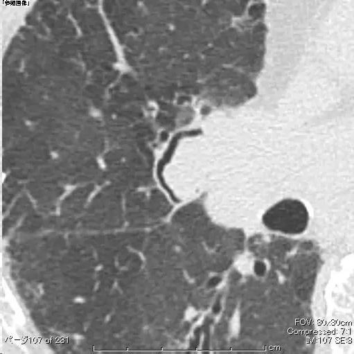

## Radiographsand CT scans（英）
An air crescent is a collection of air in a crescentic shape thatseparates the wall of a cavity from an inner mass (Fig 3). The air crescentsign is often considered characteristic of either Aspergillus colonization ofpre-existing cavities or retraction of infarcted lung in angioinvasive aspergillosis(9,10). However, the air crescent sign has also been reported in other conditions,including tuberculosis, Wegener granulomatosis, intracavitary hemorrhage, andlung cancer. (See also mycetoma.)
# X线成像与CT扫描 （中）
新月征是肺内团块状病灶内的空腔里有呈新月形积聚的气体使腔壁分开的表现。新月征常常被认为已有空洞内霉菌定植的特征，或为血管侵袭性曲菌病致肺梗死而引起肺毁陷的特征。然而，也有报告新月征出现在其他病变中的，包括结核，韦格氏肉芽肿病，腔内出血，和肺癌（参见足分支菌病）。

新月征（红箭），晕圈征（蓝箭），以月亮来比拟。

一个月前的晕圈征，一个月后变成新月征。

新月，童话般浪漫；

新月征..... 让人想起恶心的霉菌::>_<::
