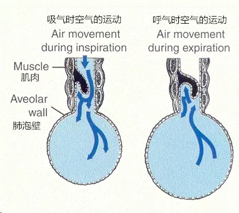
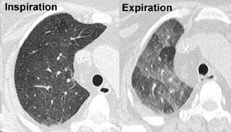
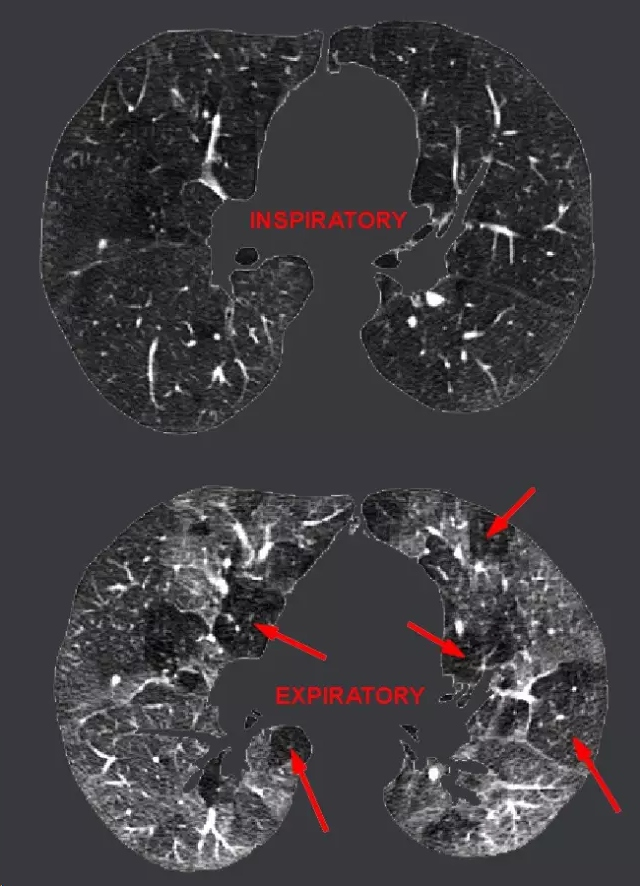
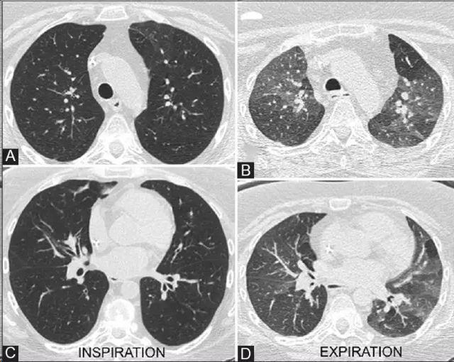

# air trapping 空气潴留
## Pathophysiology（英）
       — Air trapping is retention of air in the lung distal to an obstruction (usually partial). 
## 病理生理学（中）
       — 空气潴留是指空气被困在梗阻处远端的末梢肺组织内（通常为部分性的）。

 注意观察示意图：呼气时小气道形成活瓣性阻塞，空气无法排出而滞留在肺泡内。
## CT Scan（英）
       —Air trapping is seen on end-expiration CT scans as parenchymal areas with less than normal increase in attenuation and lack of volume reduction. Comparison between inspiratory and expiratory CT scans can be helpful when air trapping is subtle or diffuse (11,12) (Fig 4). Differentiation from areas of decreased attenuation resulting from hypoperfusion as a consequence of an occlusive vascular disorder(eg, chronic thrombo embolism) may be problematic (13), but other findings of airways versus vascular disease are usually present. (See also mosaic attenuation pattern.)

吸气相（左）；呼气相（右）
## CT扫描（中）
       —空气潴留表现为：呼气末CT扫描时受累的肺组织密度增加小于正常肺，且容积不缩小。比较吸气相与呼气相的CT扫描有助于发现隐匿或者弥漫的空气潴留。有时，继发于肺血管阻塞病变（如，慢性血栓性栓塞）所致血流低灌注可导致受累区域CT密度下降，此时与空气潴留鉴别并不容易，要注意观察通常伴随出现的气道或血管性疾病征象，可有助于鉴别诊断。（参见：马赛克样密度改变）

上图：吸气相，两肺密度看不出什么差别；
下图：呼气相，红色箭头所指均为空气潴留的区域，表示小气道活瓣性阻塞，空气可进不可出。一吸一呼，能清楚地鉴别那些地方出现小气道问题，是一个简单而有效的方法。

Bronchiolitis obliterans 4 months post stem cell transplant. Inspiration and expiration axial CT images at two representative levels demonstrate areas of air trapping (A-D).
此患者为干细胞移植后4个月并发闭塞性细支气管炎，吸气末和呼气末CT扫描显示空气潴留征。[病例来源：印度放射与影像学杂志] 

A.吸气相，B.呼气相（薄层CT所见为支气管肺泡比率增加，提示支气管扩张症及弥漫性细支气管扩张.未观察到空气潴留征。C.肺活检 Masson's trichrome染色，可见支气管粘膜下组织，其内可见小的疤痕形成，D.肺活检hematoxylin–eosin染色， 可以观察到支气管闭塞改变。