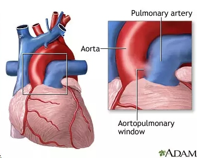
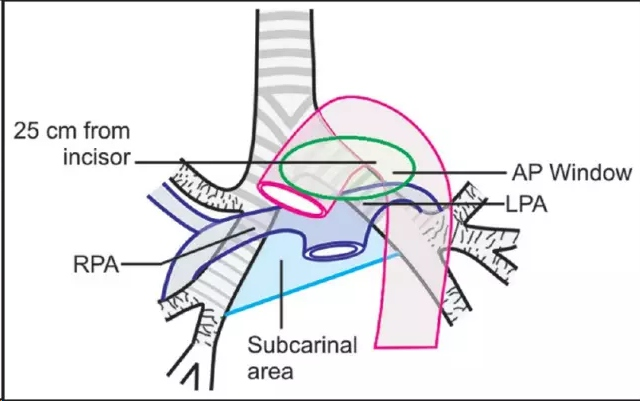
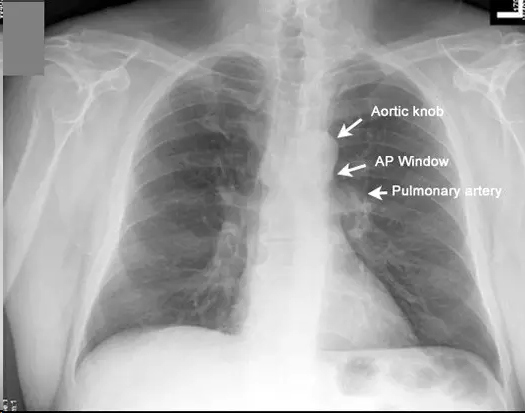
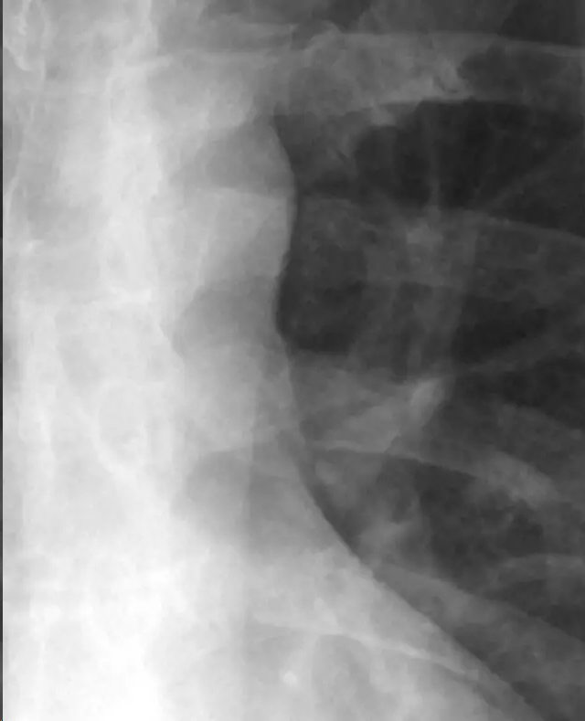
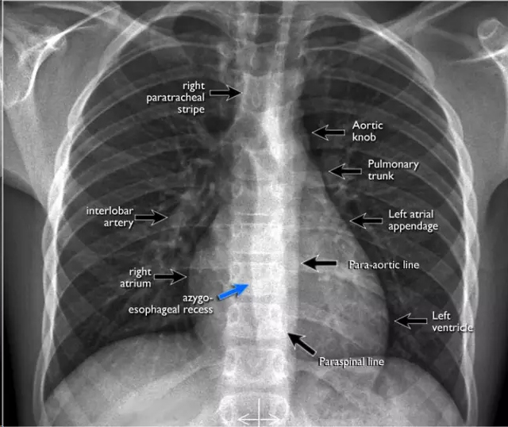
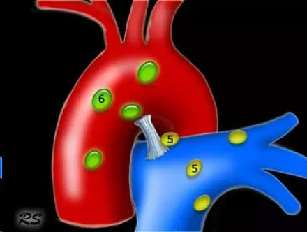
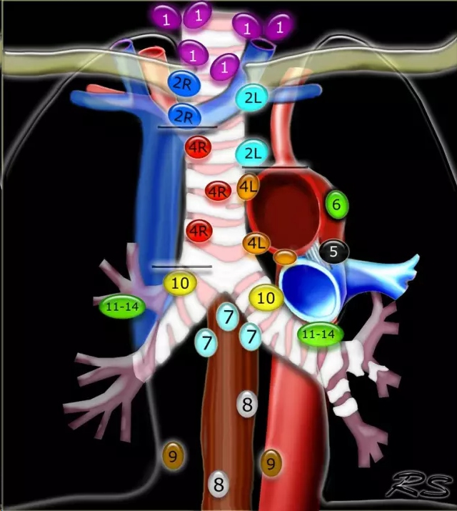
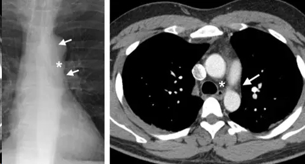
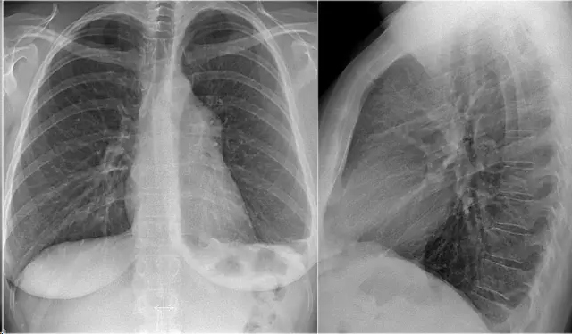
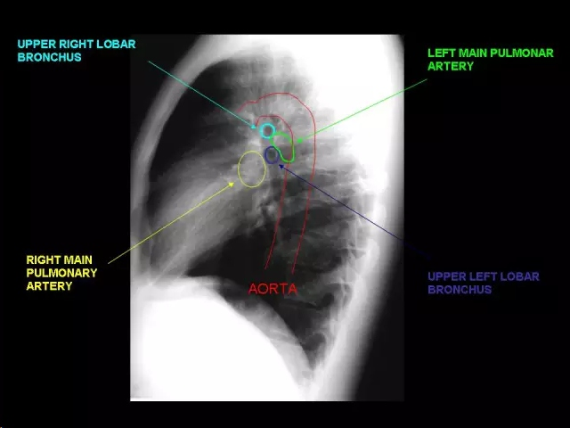

# aortopulmonary window 主肺动脉窗
## Anatomy（英）
The aortopulmonary window is the mediastinal region bounded anteriorly by the ascending aorta, posteriorly by the descending aorta, cranially by the aortic arch, inferiorly by the left pulmonary artery, medially by the ligamentum arteriosum, and laterally by the pleura and left lung (15,16).
## 解剖（中）
主肺动脉窗是纵隔里的一个区域，前界为升主动脉，后界为降主动脉，上界为主动脉弓，下界为左肺动脉。动脉韧带（编者注：未闭合前称动脉导管）位于其中，外侧则以胸膜和左肺为界。

示意图中绿色椭圆的范围就是主肺动脉窗的范围
## Radiographics and CT Scans（英）
Focal concavity in the left mediastinal border below the aorta and above the left pulmonary artery can be seen on a frontal radiograph (Fig 5). Its appearance may be modified by tortuosity of the aorta. The aortopulmonary window is a common site of lymphadenopathy in a variety of inflammatory and neoplastic diseases.

Aortic knob=主动脉结；AP Window=主肺动脉窗；Pulmonary artery=肺动脉

放大看看（原文的fig.5）

## X线成像与CT扫描（中）
 在胸部X线前后位上，主肺动脉窗表现为上纵隔左侧缘的局部凹陷，位于主动脉下左肺动脉上。主动脉迂曲会使凹陷更明显（编者注：需要有较好的三维解剖空间概念才能辨认，青年人主动脉结不明显，对初学者来说理解难度更大一点，老年人主动脉弓延长，使得主动脉结明显而突出，衬托出的凹陷较为明显，容易辨认）。主肺动脉窗是淋巴结增大的常见部位，可见于不同的炎症性病变或肿瘤性病变。

这张PA位照片，你能辨认出多少结构呢？
来，让我们逐个辨认↓↓↓
*右侧*
*** 

Aortic knob——主动脉结
Pulmonary trunk——肺动脉干
Left artial appendage——左心房耳
Para-aortic line——主动脉旁线
Left ventricle——左心室
paraspinal line——脊柱旁线

*左侧*
*** 

right paratracheal stripe——气管右旁带
interlobar artery——叶间动脉
right artrium——右心房
azygo-esophageal recess——奇静脉-食道隐窝

这是一个比较立体的主肺动脉窗结构，其中5,6两个数字的位置，就是指的第五、六组淋巴结所在。我们看看正面观是怎么的？↓↓↓

正面观，5、6组淋巴结增大会填满主肺动脉窗的空间并凸向左肺，表现为主肺动脉窗消失，局部密度增高，甚至呈结节样向左肺突出。当然，现在CT扫描就更容易显示这个区域的淋巴结肿大了。

胸片与CT对照，✤所在处就是主肺动脉窗

辨认一下？X线胸片侧位相不是那么容易分辨哦。

* UPPER RIGHT LOBAR BRONCHUS=右上叶支气管
* RIGHT MAIN PULMONARY ARTERY=右肺动脉主干
* AORTA=主动脉
* LEFT MAIN PULMONARY ARTERY=左肺动脉主干
* nUPPER LEFT LOBAR BRONCHUS=左上叶支气管

