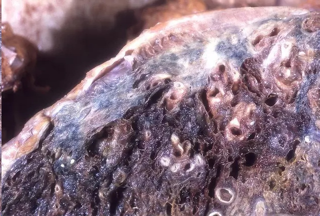
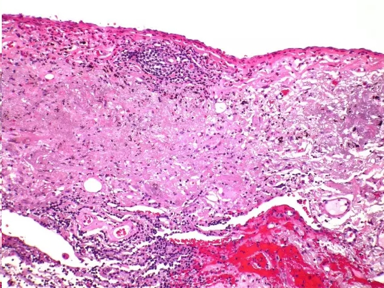
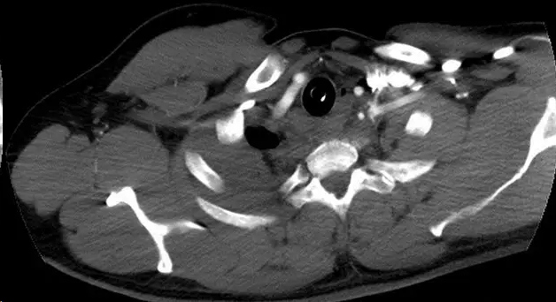
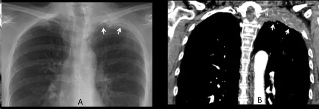

# Apical cap 肺尖帽
## Pathology（英）
An apical cap is a caplike lesion at the lung apex, usually caused by intrapulmonary and pleural fibrosis pulling down extrapleural fat (17) or possibly by chronic ischemia resulting in hyaline plaque formation on the visceral pleura (18). The prevalence increases with age. It can also be seen in hematoma resulting from aortic rupture or in other fluid collection associated with infection or tumor, either outside the parietal pleura or loculated within the pleural space (19).
## 病理（中）
肺尖帽是位于肺尖的帽状病灶，通常由肺内和胸膜的纤维化把胸膜外脂肪向下牵拉而形成，或可能由慢性缺血引起脏层胸膜透明斑块形成而致。有随年龄增大而多见的现象。它也可见于主动脉破裂继发局部血肿，也可为伴随感染或肿瘤而存在的局限性积液，可位于胸膜顶外或包裹在胸膜腔内。

肺尖帽的大体标本，胸膜顶可见明显凹陷的疤痕。

显微镜下可见大量的疤痕纤维组织增生
## Radiographics and CT Scans（英）
The usual appearance is of homogeneous soft-tissue attenuation capping the extreme lung apex (uni- or bilaterally), with a sharp or irregular lower border (Fig 6). Thickness is variable, ranging up to about 30 mm (17). An apical cap occasionally mimics apical consolidation on transverse CT scans.

Fig.6 左侧肺尖帽（黑箭）
## X线成像与CT扫描（中）
肺尖帽的最常见的表现为肺尖帽状均匀的软组织密度影（单侧，或双侧），下缘清晰或不规则。厚度可以不同，最厚的可达30mm。在CT横断扫描上，肺尖帽偶尔会被误认为肺尖的实变。

右侧肺尖帽

左侧肺尖帽

肺尖帽的变化，中间隔了三年......

