# atelectasis 肺不张（肺膨胀不全）
## Pathology（英）
 Atelectasis is reduced inflation of all or part of the lung (20). One of the commonest mechanisms is resorption of air distal to airway obstruction (eg, an endobronchial neoplasm) (21). The synonym collapse is often used interchangeably with atelectasis, particularly when it is severe or accompanied by obvious increase in lung opacity.
## 病理（中）
 肺不张是指全肺或部分肺膨胀不良。最常见的机理是气道阻塞后远端的气体被吸收（阻塞原因如，支气管内新生物）。肺萎陷常可作为不张的同义词使用，尤其应用于描述肺透亮度明显降低时。

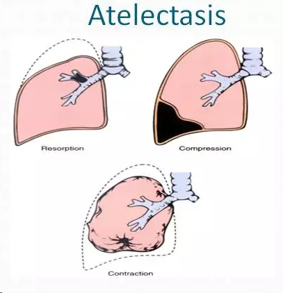

肺不张的原因有：阻塞-远端气体吸收；外压性；牵拉性（如纤维化）

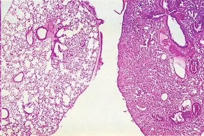

左侧：正常肺组织；右侧：肺不张组织

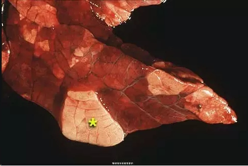

肺不张大体标本，常常容易与肺淤血混淆。☆所在为正常肺组织。

## Radiographics and CT Scans（英）
 Reduced volume is seen, accompanied by increased opacity (chest radiograph) or attenuation (CT scan) in the affected part of the lung (Fig 8). Atelectasis is often associated with abnormal displacement of fissures, bronchi, vessels, diaphragm, heart, or mediastinum (22). The distribution can be lobar, segmental, or subsegmental. Atelectasis is often qualified by descriptors such as linear, discoid, or platelike. (See also linear atelectasis, rounded atelectasis.)

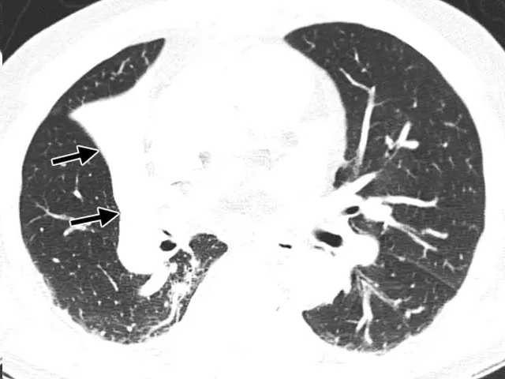

fig.8

## X线成像与CT扫描（中）
受累的肺叶出现容积减少，伴有透亮度下降（胸部X线成像）或密度增加（CT扫描）。肺不张通常伴有叶间裂、支气管、肺血管、膈肌、心影、或纵隔的移位。不张的累及范围可为一叶、一段、或亚段。不张的形态常描述为线样，盘状、板层状。【参阅线状肺不张、圆形肺不张】

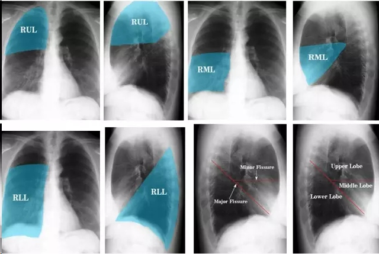

右上、中、下肺正常X线解剖位置图

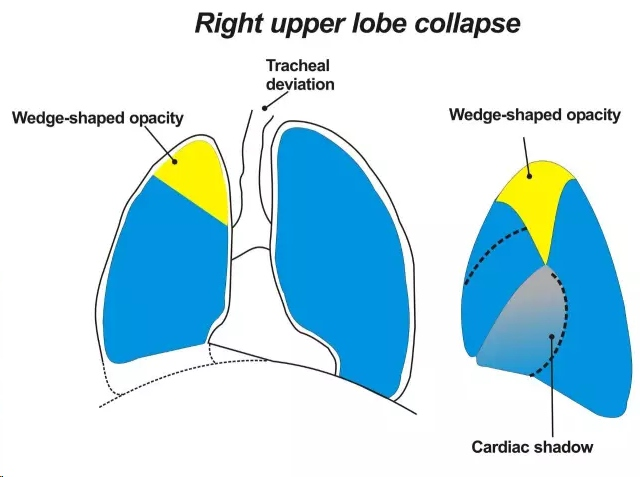

右上叶不张示意图

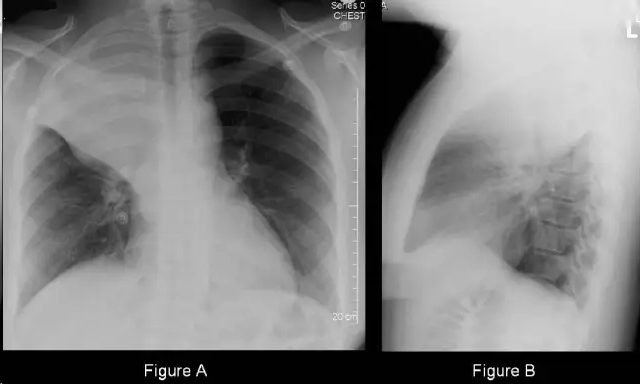

右上肺不张

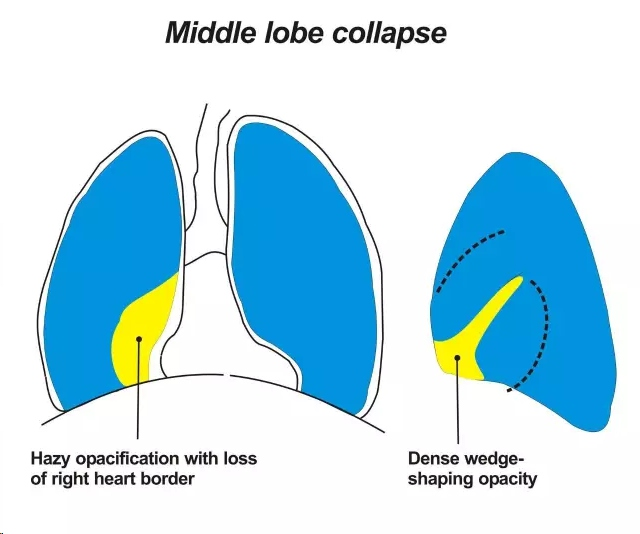

右中叶不张示意图

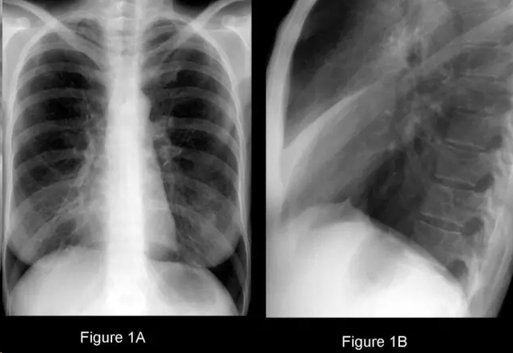

右中叶不张

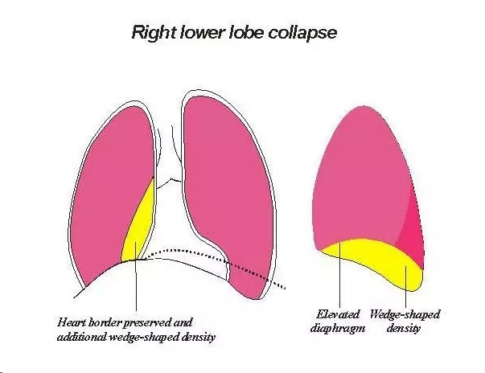

右下叶不张示意图

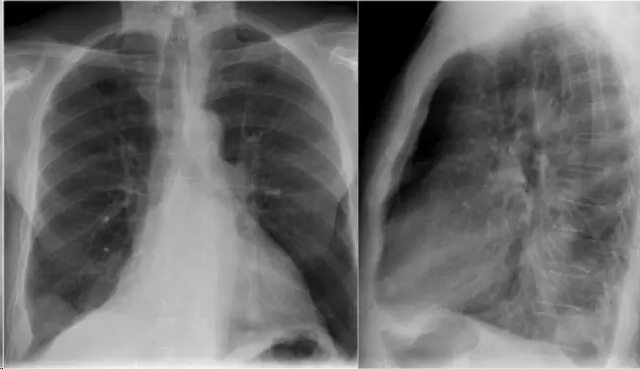

右下肺不张

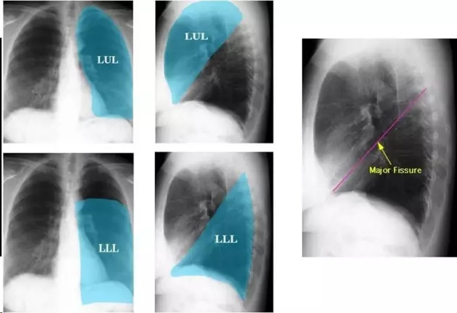

左肺上叶与下叶的正常X线解剖位置图

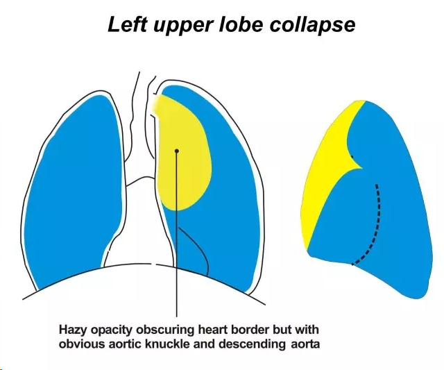

左上肺不张示意图

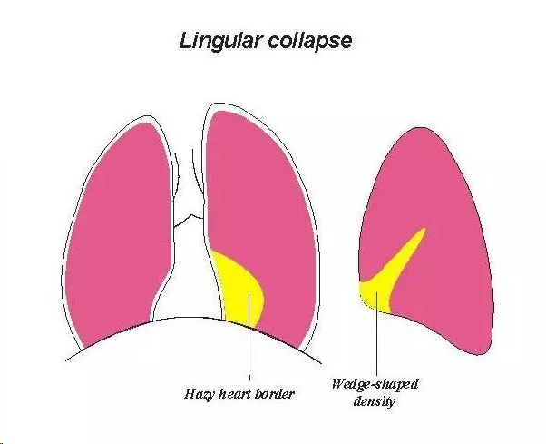

舌叶（段）不张示意图

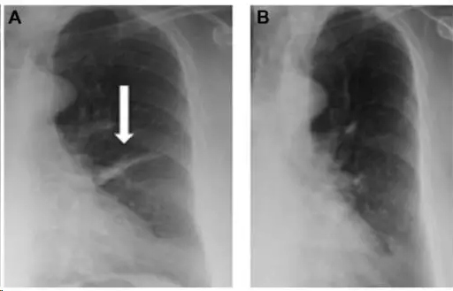

左肺舌叶不张

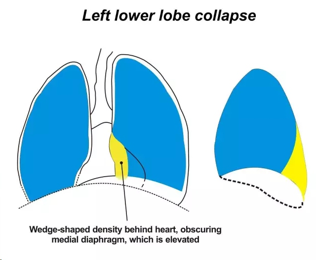

左下肺不张示意图

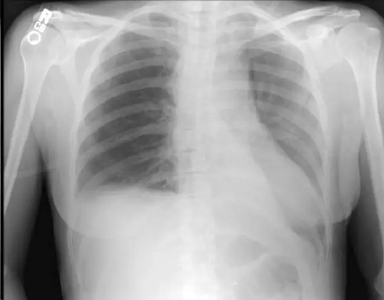

*** 
**思考题**
为什么肺不张的边缘，有的很清楚，有的却不清楚？为什么有的在正位胸片上清楚，但在侧位胸片上则不清楚（如左下肺不张）？有的在侧位片上很清楚，但在正位片上又不清楚（如中叶不张，左上叶不张）？原因何在？