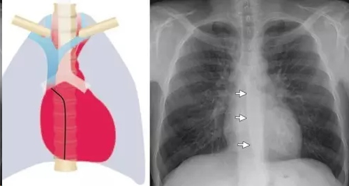
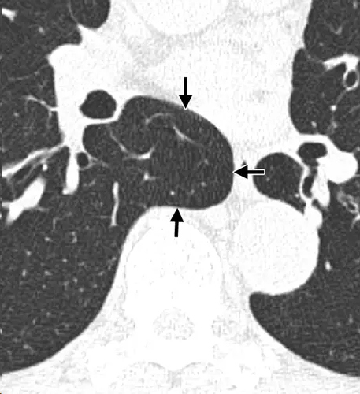
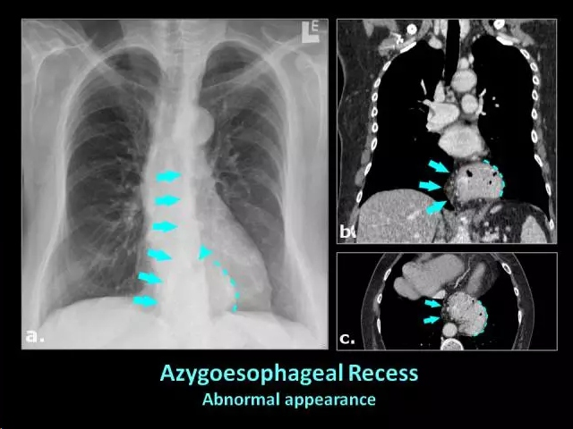
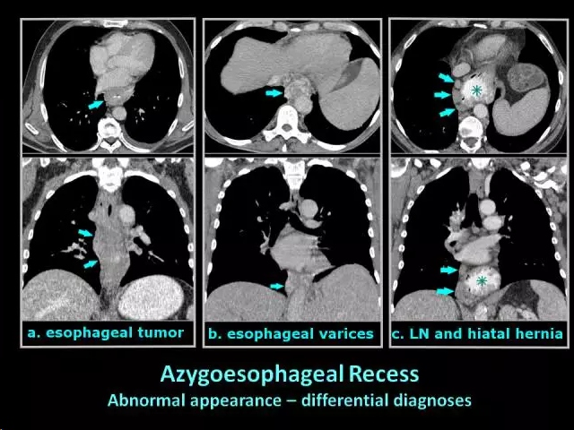
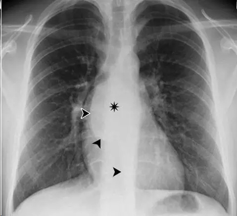

# azygoesophageal recess 奇静脉食道隐窝
## Anatomy（英）
The azygoesophageal recess is a right posterior mediastinal recess into which the edge of the right lower lobe extends. It is limited superiorly by the azygos arch, posteriorly by the azygos vein and pleura anterior to the vertebral column, and medially by the esophagus and adjacent structures.
## 解剖（中）
奇静脉食管隐窝，是右后纵隔隐窝，右下肺叶的边缘一直延伸到此以隐窝为界。隐窝的上界是奇静脉弓，后界是奇静脉和脊柱前方的胸膜，在食管和邻近结构中间。

右图黑线洼陷处一下即奇静脉食管隐窝，X线正位胸片为白箭头所指处

蓝色箭头所指即为奇静脉食管隐窝

正常奇静脉食管隐窝X线胸片与CT各向成像对照。
Ao=主动脉
AER=奇静脉食管隐窝
RA=右心房
PA=肺动脉
LA=左心房
## Radiographics and CT Scans（英）
 On a frontal chest radiograph, the recess is seen as a vertically oriented interface between the right lower lobe and the adjacent mediastinum (the medial limit of the recess). Superiorly, the interface is seen as a smooth arc with convexity to the left. Disappearance or distortion of part of the interface suggests disease (eg, subcarinal lymphadenopathy). On CT scans, the recess (Fig 9) merits attention because small lesions located in the recess will often be invisible on chest radiographs (23).

fig.9 三个黑箭头所围绕的即是奇静脉食管隐窝的局部横断面
## X线成像与CT扫描（中）
在正位胸片上，奇静脉食管 隐窝在右肺下叶和相邻的纵隔之间（隐窝的内侧缘），呈一垂直的界面。上缘，呈一光滑的弓状向左突出。隐窝的消失或变形提示病变存在（如，隆突下淋巴结）。在CT扫描上能发现该隐窝内的小病灶，而这些小病灶一般在胸片上是无法观察到的。

(a) PA chest radiograph shows an abnormal rightward convexity of the lower third of the azygoesophageal recess (arrows). Note the mass, that causes the rightward bulge of the recess, contains an air bubble (arrowhead). Cor MPR CT scan (b) and axial CT image (c) demonstrate a large hiatal hernia as a cause of the abnormal-appearing azygoesophageal recess. 
巨大食道裂孔疝，a正位胸片；b.冠状位CT-MPR；C. CT横断位

An abnormal contour or convexinty of the azygoesophageal line may be due to various conditions: (a) Axial CT image and cor MPR CT scan show thickened esophageal wall (arrows) in a patient with esophageal carcinoma. (b) Axial CT image and cor MPR CT scan show gastroesophageal varices (arrows). (c) Axial CT image and cor MPR CT scan show lymphadenopathy (arrows) and hiatal hernia (*) in a patient with lymphoma.
a.食管肿瘤; b. 食管静脉曲张；c.淋巴结及食道裂孔疝

正位胸片和CT均可见奇静脉食管隐窝占位，提示隆突下肿物。

