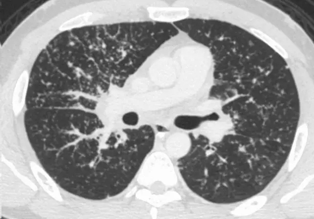
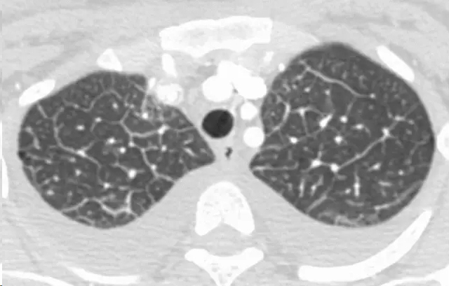
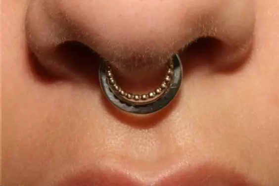

# beaded septum sign 串珠样间隔征
## CT Scans（英）

This sign consists of irregular and nodular thickening of interlobular septa reminiscent of a row of beads (Fig 10). It is frequently seen in lymphangitic spread of cancer and less often in sarcoidosis (24).

fig.10 黑箭所指为串珠间隔征
## CT扫描（中）
该征象由不规则和结节样增厚的叶间隔构成，令人觉得像是一串珠子。这种征象常常出现在癌症的淋巴道播撒，其次可见于结节病。

白箭所指：串珠间隔征

结节病病例CT扫描显示串珠样间隔征

嘻嘻，其实如果你上网搜beaded septum sign，看到的更多是下面这种图，额，不知穿一个这样的串珠鼻环痛不痛？ 

