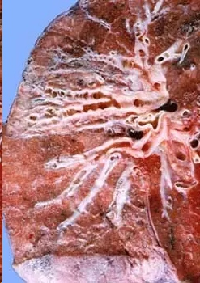
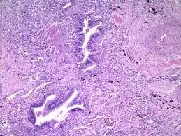
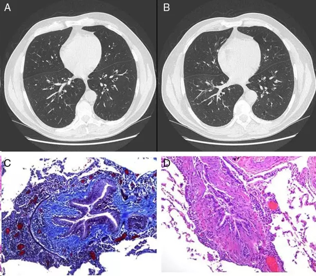
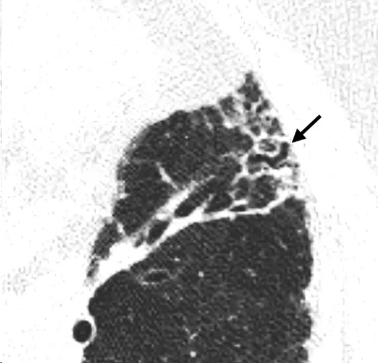
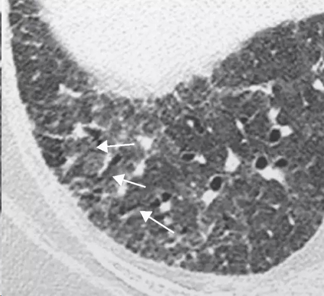
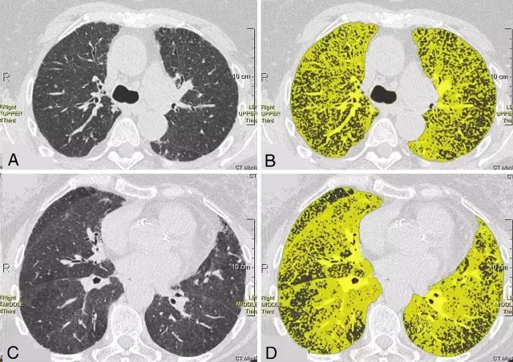
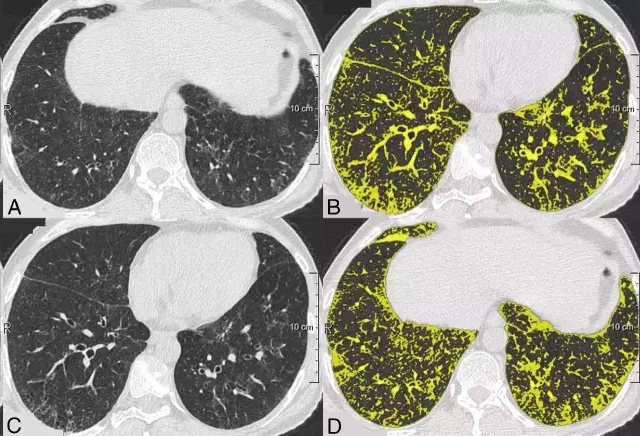

# bronchiolectasis细支气管扩张

## Pathology（英）
Bronchiolectasis is defined as dilatation of bronchioles. It is caused by inflammatory airways disease (potentially reversible) or, more frequently, fibrosis.

## 病理（中）
 细支气管扩张症界定为细支气管的扩张。细支气管扩张可由气道炎性病变所致（可以为可逆的）或者更常见由肺纤维化导致。

细支气管扩张大体标本，注意看胸膜下所见细支气管的扩张情况。

显微镜下观察到的细支气管扩张

Discrete bronchiectasis and diffuse bronchiolectasis were observed on the CT scan 
在CT扫描中，可见散在和弥漫的细支气管扩张。【病例来源：Arch Bronconeumol.2013;49:411-2 - Vol. 49 Num.9 DOI: 10.1016/j.arbr.2013.07.009】
(A and B) An increase in the bronchoalveolar ratio is seen in the high definition CT scan during inspiration and expiration, a radiological sign suggestive of bronchiectasis and diffuse bronchiolectasis. No radiological signs of air trapping are observed. (C) Histological sample obtained from lung biopsy: Masson's trichrome stain; bronchiolar submucosal fibrosis is seen, along with the appearance of small scars. (D) Histological sample obtained from the lung biopsy: hematoxylin–eosin stain: bronchial obliteration can be observed.
图A和B，高分辨CT扫描，深吸气相和深呼气相，支气管肺泡比率增加，这是一个提示支气管扩张和弥漫性细支气管扩张的影像学征象。未见空气潴留征象。图C.肺活检病理，马松三色染色，可见支气管粘膜下纤维化，伴有小疤痕。图D.肺活检标本，苏木精-伊红染色，可见支气管闭塞改变

##  CT scans（英）
When dilated bronchioles are filled with exudate and are thick walled, they are visible as a tree-in-bud pattern or as centrilobular nodules (31,32). In traction bronchiolectasis, the dilated bronchioles are seen as small, cystic, tubular airspaces, associated with CT findings of fibrosis (Fig 12). (See also traction bronchiectasis and traction bronchiolectasis, tree-in-bud pattern.)

Fig.12 细支气管扩张
## CT扫描（中）
当扩张的细支气管充满液体或管壁增厚时，它们可以表现为树芽征或呈小叶中央性结节样。而在牵拉性细支气管扩张症，扩张的细支气管表现为细小的，囊状的，管状的含气腔隙，伴有纤维化的CT表现（Fig 12)。（参考牵拉性支气管扩张和牵拉性细支气管扩张、树芽征等部分章节）

Traction bronchiectasis/bronchiolectasis. HRCT scan of the right lung base (lung window) shows a ground-glass pattern associated with asymmetric dilatation of the distal bronchial/bronchiolar structures (arrows).【病例来源：Radiologia Vol. 54. Núm. 06. November 2012 - December 2012】
牵拉性支气管扩张/细支气管扩张。右下肺基地段HRCT（肺窗）显示磨玻璃样改变伴有不对称的末梢支气管/细支气管扩张

伪彩处理后显示的细支气管扩张

伪彩处理后显示的细支气管扩张

